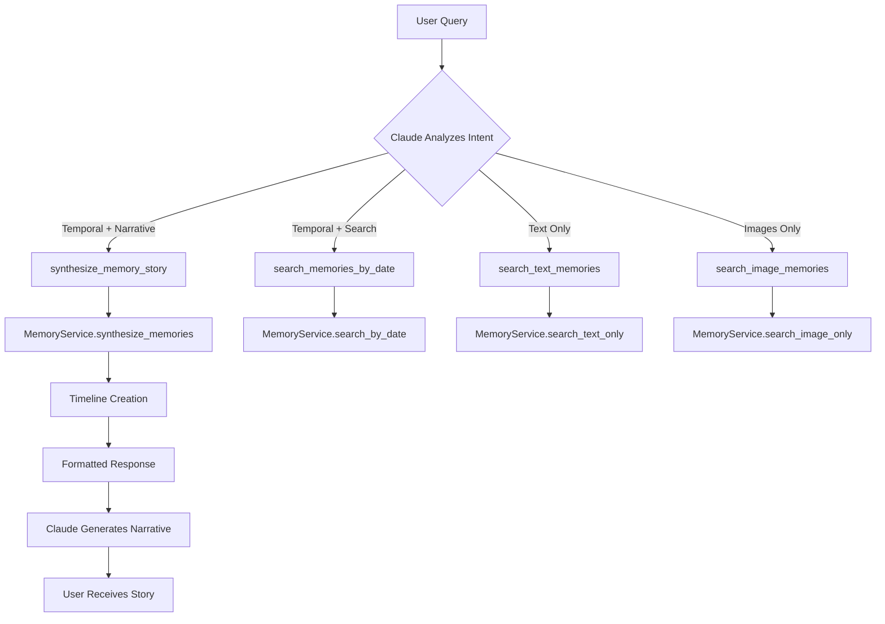

# Claude Desktop Agentic Flow Usage Examples

This document shows how Claude Desktop uses the memory-map MCP server with agentic behavior to answer complex queries.

## Setup

Ensure your `claude_desktop_config.json` is configured with the memory-map MCP server (see main README).

## Example 1: Date-Based Query

### User Query
```
"What was I doing on October 15?"
```

### Claude's Agentic Decision Process

**Step 1: Query Analysis**
- Detected temporal intent: "October 15"
- Detected activity intent: "doing"
- Context needed: Both text memories (diary, notes) and images (photos, screenshots)

**Step 2: Tool Selection Strategy**

Claude chooses: `synthesize_memory_story`

Why?
- Handles date filtering automatically
- Searches both text and images
- Creates chronological timeline
- Best tool for narrative questions

**Step 3: Tool Execution**

```json
{
  "tool": "synthesize_memory_story",
  "parameters": {
    "query": "daily activities and events",
    "start_date": "October 15",
    "n_results_per_type": 10
  }
}
```

**Step 4: Claude's Response**

```
Based on your memories from October 15, 2025, here's what you did that day:

Morning:
- You started with a morning jog in the park. The weather was perfect, and you
  documented this as part of your daily health routine.

Midday:
- You had a productive team meeting about the Q4 roadmap, where you discussed
  new features and the project timeline with your colleagues.

Evening:
- You finished reading "The Design of Everyday Things" and noted some great
  insights on user-centered design.

It looks like it was a well-balanced day with exercise, productive work,
and personal development through reading!
```

---

## Example 2: Multi-Source Synthesis

### User Query
```
"Show me all my work-related memories from last week"
```

### Claude's Agentic Process

**Step 1: Tool Selection - Multiple Calls**

Claude makes parallel calls:

1. `search_text_memories`
   ```json
   {
     "query": "work team meeting project",
     "n_results": 15
   }
   ```

2. `search_image_memories`
   ```json
   {
     "query": "work office meeting screenshots",
     "n_results": 15
   }
   ```

3. `search_memories_by_date`
   ```json
   {
     "query": "work",
     "start_date": "2025-10-08",
     "end_date": "2025-10-15",
     "n_results": 20
   }
   ```

**Step 2: Synthesis**

Claude combines results from all three searches, removes duplicates, and organizes chronologically.

**Step 3: Response**

```
Here are your work-related memories from last week (Oct 8-15):

📅 Monday, Oct 8:
- Sprint planning meeting notes
- Updated project timeline document

📅 Tuesday, Oct 9:
- Code review session
- [Screenshot] Pull request discussions

📅 Wednesday, Oct 10:
- Client presentation prep
- [Photo] Whiteboard brainstorming session

... (continues chronologically)
```

---

## Example 3: Exploratory Query

### User Query
```
"I remember taking some photos at a park, can you find them?"
```

### Claude's Agentic Process

**Step 1: Initial Tool Selection**

Claude chooses: `search_image_memories` (more specific than unified search)

```json
{
  "tool": "search_image_memories",
  "query": "park outdoor photos nature",
  "n_results": 10
}
```

**Step 2: Follow-up (if needed)**

If results are ambiguous, Claude might ask:
```
I found 8 photos that might match. Do you remember approximately when
you took them? I can narrow down the results by date.
```

If user responds: "Last month"

**Step 3: Refined Search**

```json
{
  "tool": "search_memories_by_date",
  "query": "park photos",
  "start_date": "2025-09-01",
  "end_date": "2025-09-30",
  "n_results": 20
}
```

---

## Example 4: Complex Narrative Query

### User Query
```
"Can you create a story of my October so far based on my memories?"
```

### Claude's Agentic Process

**Step 1: Tool Selection**

Claude chooses: `synthesize_memory_story` with broad date range

```json
{
  "tool": "synthesize_memory_story",
  "query": "October activities events experiences",
  "start_date": "2025-10-01",
  "end_date": "2025-10-17",
  "n_results_per_type": 20
}
```

**Step 2: Narrative Generation**

Claude receives a chronological timeline and crafts a story:

```
Your October Journey

Early October started with professional growth - you attended an AI
conference on the 14th, diving deep into machine learning concepts...

Mid-month brought balance to your routine. On October 15th, you
maintained your health with a morning jog, tackled important work
discussions about Q4 planning, and invested in learning through reading...

[Photos from the period show your active lifestyle, including outdoor
activities and collaborative work sessions...]

The theme of your October seems to be balanced growth: professional
development, physical wellness, and continuous learning.
```

---

## Agentic vs Non-Agentic Comparison

### Non-Agentic Approach (Old)
```
User: "What was I doing on October 15?"

Claude calls:
- search_memories("October 15")

Result:
- Mixed results, no temporal filtering
- Text and images jumbled together
- No chronological order
- Claude must manually organize
```

### Agentic Approach (New)
```
User: "What was I doing on October 15?"

Claude's reasoning:
1. Analyze: temporal + activity query
2. Select: synthesize_memory_story (best fit)
3. Execute: with date filter + narrative context
4. Synthesize: coherent chronological story

Result:
- Automatically filtered by date
- Organized in timeline
- Both text and images integrated
- Coherent narrative response
```

---

## Available Agentic Tools

### 1. `synthesize_memory_story` ⭐ PRIMARY AGENTIC TOOL
**When to use:** Complex queries requiring narrative synthesis
- "What was I doing on [date]?"
- "Tell me about my week"
- "What happened during [time period]?"

### 2. `search_memories_by_date`
**When to use:** Date-specific searches
- "Find memories from October 15"
- "Show me last week's activities"

### 3. `search_text_memories` + `search_image_memories`
**When to use:** Parallel specialized searches
- "Find my work notes AND screenshots"
- "Show text about X and photos about Y"

### 4. `search_memories` (Legacy)
**When to use:** Simple, unified searches
- "Find memories about Japan"
- "Search for sunset"

---

## Tips for Users

### ✅ Good Queries (Agentic-Friendly)
- "What was I doing on October 15?"
- "Tell me the story of my last week"
- "Find all work-related stuff from September"
- "Show me my fitness journey this month"

### ❌ Less Optimal Queries
- "Search" (too vague)
- "Find memory" (no context)
- Single keyword searches (better suited for simple search)

### 🎯 Best Practices
1. **Include temporal context** when relevant ("last week", "October 15")
2. **Ask narrative questions** to trigger synthesis ("What was I doing?", "Tell me about...")
3. **Be specific about sources** if needed ("my notes", "photos")
4. **Trust the agent** - Claude will select the best tool combination

---

## How It Works Under the Hood



The key difference: Claude *decides* which tools to use and how to combine them, rather than being limited to a single search operation.
